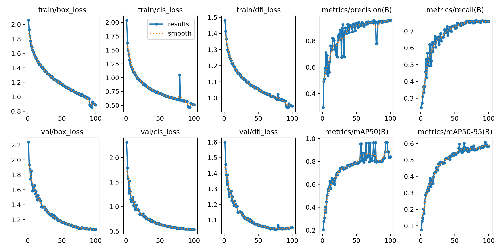
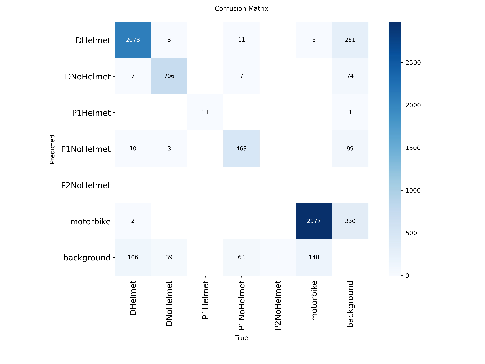

# 📹 CCTV Traffic Violation Detection System (Helmet Monitoring)

> **Lưu ý đặc biệt:** Mô hình được tối ưu hóa chuyên biệt cho **Camera giám sát (CCTV)** với góc quay từ trên cao xuống (High-angle/Top-down view).

## 🎯 Thách thức & Giải pháp (Key Challenges & Solutions)

Hệ thống giải quyết các vấn đề đặc thù của camera giao thông tại Việt Nam mà các mô hình thông thường (pretrained trên COCO/ImageNet) thường thất bại:

1.  **Góc nhìn (Perspective):**
    * *Vấn đề:* Camera trên cao nhìn xuống chủ yếu thấy đỉnh đầu, vai và yên xe, khác hoàn toàn với ảnh chụp ngang (thấy rõ mặt, bánh xe).
    * *Giải pháp:* Curate (tinh chỉnh) bộ dữ liệu tập trung vào các mẫu ảnh góc cao (High-angle samples) để model học được đặc trưng hình học từ góc nhìn này.

2.  **Che khuất (Occlusion):**
    * *Vấn đề:* Mật độ giao thông cao, xe này che xe kia.
    * *Giải pháp:* Sử dụng **Mosaic Augmentation** mạnh (0.8) trong quá trình train để model học cách nhận diện vật thể ngay cả khi bị che khuất một phần.

3.  **Kích thước vật thể (Small Objects):**
    * *Vấn đề:* Camera ở xa, mũ bảo hiểm chỉ chiếm số lượng pixel rất nhỏ.
    * *Giải pháp:* Sử dụng mô hình **YOLOv8** với kiến trúc Feature Pyramid Network (FPN) tốt cho việc phát hiện vật thể nhỏ, kết hợp input size 640x640 (hoặc 1280 nếu cần độ chính xác cao hơn).

## 📸 Dữ liệu & Môi trường (Data Context)

* **Dataset Context:** Ảnh thu thập từ Camera giao thông thực tế (CCTV) và Dataset mô phỏng góc nhìn trên cao.
* **Conditions:** Đã kiểm thử tốt trong điều kiện ánh sáng ban ngày và mật độ xe trung bình-cao.
## 📊 Hiệu năng & Trực quan hóa (Performance & Visuals)

### 1. Biểu đồ huấn luyện (Training Metrics)

*Quá trình huấn luyện cho thấy sự ổn định của hàm Loss và độ chính xác (mAP) tăng dần, đạt đỉnh ở Epoch ~90.*

### 2. Khả năng phân loại (Confusion Matrix)

*Mô hình phân biệt rất tốt giữa các lớp (ví dụ: DNoHelmet vs P1NoHelmet), tỷ lệ nhầm lẫn cực thấp.*

### 3. Kết quả thực tế trên CCTV (Inference Demo)
| Tình huống | Kết quả |
| :--- | :--- |
| **Đông đúc & Che khuất** |  |
| **Góc nhìn cao (Top-down)** |  |